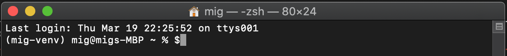
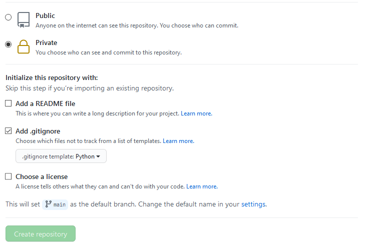
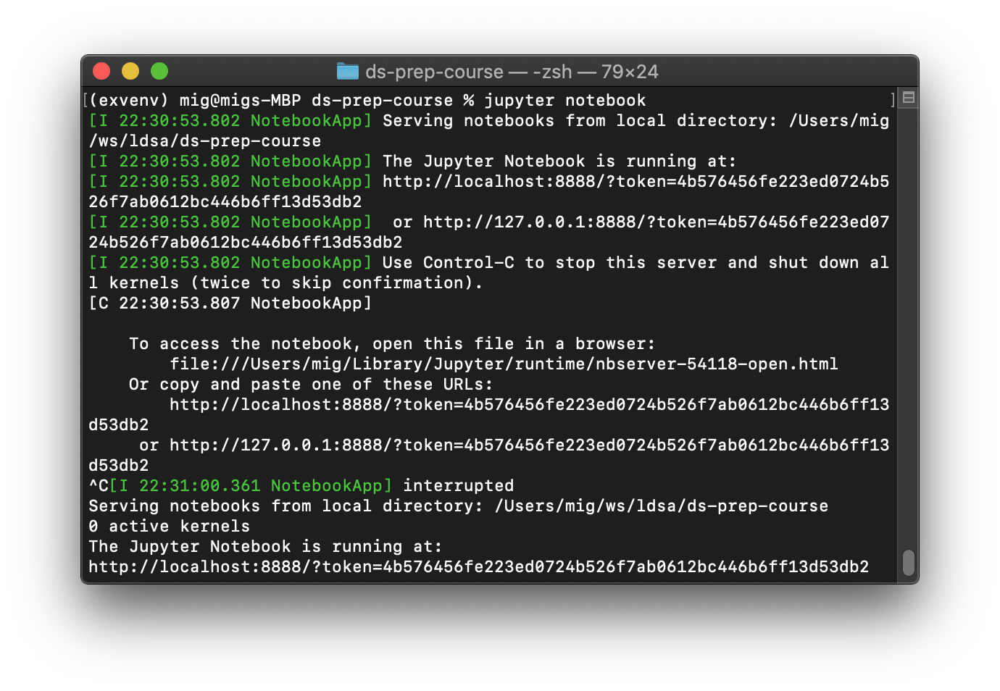
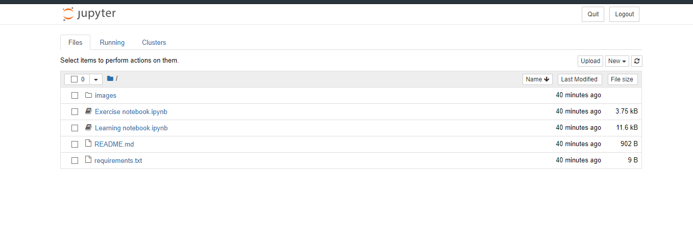
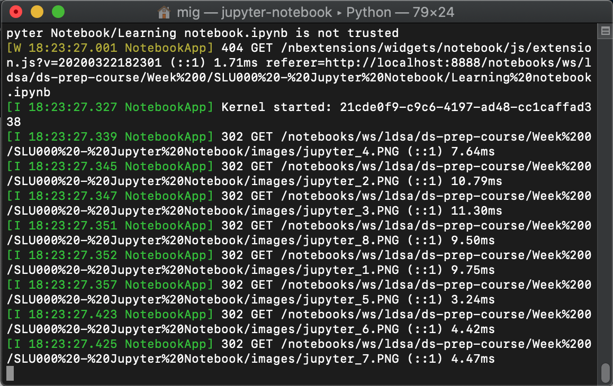

# Data Science Prep Course 2021

Welcome to the Data Science Prep Course repository! 🧑‍💻

Your first step in this journey is to **carefully read** the steps in this tutorial. You'll learn:

- How to set up your environment;
- The weekly workflow to follow during the Prep Course.

<br>

# Prep Course Tutorial

Follow these steps to make sure your machine is ready **before** the course starts (April 5, 2021).

### **Initial Setup (do this before April 5 !!)**

1. [Initial Setup](#1-initial-setup)

    1.1 (a) [Windows 10 Setup](#11a-Windows-10-Setup)

    1.1 (b) [Ubuntu Setup](#11b-Ubuntu-Setup)

    1.1 (c) [MacOS Setup](#11c-macos-setup)

    1.2 [Setup Git and GitHub](#12-setup-git-and-github)

    1.3 [Setup your Workspace Repository](#13-setup-your-workspace-repository)

    1.4 [Clone the ds-prep-course-2021 repository](#14-clone-the-ds-prep-course-2021-repository)

    1.5 [Creating a virtual environment](#15-creating-a-virtual-environment)

    1.6 [Follow the learning unit workflow for Week 00](#16-testing-the-workflow)

### **Weekly workflow**

2. [Learning Unit Workflow](#2-learning-unit-workflow)

3. [Updates to Learning Units](#3-updates-to-learning-units)

### **Help**

4. [How to ask for help](#4-how-to-ask-for-help)

5. [Troubleshooting](#6-Troubleshooting)

6. [Tips and Tricks](#7-Tips-and-Tricks)

7. [Tutorial videos from Prep Course 2020](#8-tutorial-videos)

<br>

🎁🎬 Check the [tutorial videos](#videos) if you have any doubts after following this tutorial. These videos were made for the **Prep Course** of year 2020, so there may be some differences.

<br>

---
## **1. Initial Setup**


Here you'll setup and learn about all the tools you'll be
using during the academy. Don't worry if you can't figure out what some of the commands you will use do. Anything that is important will be explained in more detail during the course.

⚠️ **Important**: You should complete this setup by April 5, as the course will begin on that day. If you are struggling to install any of the software mentioned below, tell us ASAP!


<br>

### **1.1(a) Windows 10 Setup**

This section deals with setting up Windows Subsystem for Linux (WSL) on Windows 10.
If you are using Ubuntu, skip this section ([go to Ubuntu Setup](#11b-Ubuntu-Setup)).
If you are using MacOS, skip this section ([go to MacOS Setup](#11c-macos-setup)).

**Step 1:** Follow **[this guide](guides/Windows_Subsystem_for_Linux_Installation_Guide_for_Windows_10.md)** to setup WSL on Windows 10.

>**Why do I need to install WSL?**
>
> Windows Subsystem for Linux (WSL) enables you to run Linux command line inside Windows. All of our setup instructions are created for Mac OS/Ubuntu, so we won't be able to provide support on how to do it on Windows.

**Step 2:** Open a terminal (remember **[this](guides/Windows_Subsystem_for_Linux_Installation_Guide_for_Windows_10.md#Opening-the-WSL-terminal)**!!) and run the following command:

```bash
sudo apt update && sudo apt upgrade && sudo apt install git
```

**Step 3:** Open a terminal (remember **[this](guides/Windows_Subsystem_for_Linux_Installation_Guide_for_Windows_10.md#Opening-the-WSL-terminal)**!!) and check what version of Python you have by usind the command below. If your version is `Python 3.7.x` (`x` = any number), you can skip to step 4, otherwise continue with step 3.1 and 3.2

```bash
python3 --version
```

**Step 3.1:** Run the following commands to setup _Python 3.7_ (if you get an error with this command, check [this](#6-When-setting-up-python-3.7-i-get-an-error)
):

```bash
sudo add-apt-repository ppa:deadsnakes/ppa
```

**Step 3.2:** Run the following commands to install _Python 3.7_

```bash
sudo apt update && sudo apt install python3.7 -y
```

**Step 4** Run the following command to get `pip` and `venv`:
```bash
sudo apt update && sudo apt upgrade && sudo apt install python3-pip python3.7-venv -y
```
>**Why do we install these?**
>
> We'll be using `pip` which is the reference Python package manager. You should always use a virtual environment to install python packages. We'll use `venv` to set them up.

<br>

### **1.1(b) Ubuntu Setup**

This sections deals with installing some necessary packages.

**Step 2:** Open a terminal and run the following command:

```bash
sudo apt update && sudo apt upgrade && sudo apt install git
```

**Step 3:** Open a terminal and check what version of Python you have by usind the command below. If your version is `Python 3.7.x` (`x` = any number), you can skip to step 4, otherwise continue with step 3.1 and 3.2

```bash
python3 --version
```

**Step 3.1:** Run the following commands to setup _Python 3.7_ (if you get an error with this command, check [this](#6-When-setting-up-python-3.7-i-get-an-error)
):

```bash
sudo add-apt-repository ppa:deadsnakes/ppa
```

**Step 3.2:** Run the following commands to install _Python 3.7_

```bash
sudo apt update && sudo apt install python3.7 -y
```

**Step 4** Run the following command to get `pip` and `venv`:
```bash
sudo apt update && sudo apt upgrade && sudo apt install python3-pip python3.7-venv -y
```
>**Why do we install these?**
>
> We'll be using `pip` which is the reference Python package manager. You should always use a virtual environment to install python packages. We'll use `venv` to set them up.

<br>

### **1.1(c) MacOS Setup**

Some of the steps in the following sections will require _Homebrew_ for MacOS.
_Homebrew_ will make it easier to install software that we'll use later on.

**Step 1:** To open the terminal, choose one:
* In Finder , open the /Applications/Utilities folder, then double-click Terminal.
* By pressing <kbd>cmd</kbd> + <kbd>space</kbd> then type `terminal` and press <kbd>enter</kbd>.

    The terminal should now be open:

    

<br>

**Step 2:** To install Homebrew for MacOS, copy and paste the following line in the terminal:

```bash
/bin/bash -c "$(curl -fsSL https://raw.githubusercontent.com/Homebrew/install/master/install.sh)"
```

You may be prompted to install the _Command Line Developers Tools_. Confirm and, once it finishes, continue installing _Homebrew_ by pressing <kbd>enter</kbd> again.

**Step 3:** open a terminal and run the following command:

```bash
brew update --verbose
```

**Step 4:** then run the following command:

```bash
brew install git
```

**Step 5:** then run the following command:

```bash
brew install python@3.7
```

**Step 6:** then run the following command:

```bash
brew link python@3.7
```

<br>

### **1.2 Setup _Git_ and _GitHub_**

**Git** is a distributed version-control system for tracking changes in source  code. A **repository** is where code lives, and the code from the prep course will live at [`ds-prep-course-2021`](https://github.com/LDSSA/ds-prep-course-2021) repository (basically where you are right now, reading this). All the learning materials and exercises will be released (made available) on this repository.

**Step 1:** [Sign up](https://github.com/join) for a _GitHub_ account and follow the instructions.

<br>

**Step 2:** Open a terminal. Configure your email and username by running the 3 commands below. (**replace** `mig.dias.1212@gmail.com` below with the same email you used for github and `buedaswag` with your GitHub username).

```bash
git config --global user.email "mig.dias.1212@gmail.com"
git config --global user.username "buedaswag"
git config --global user.name "Bueda Swag"
```

<br>

### **1.3 Setup your Workspace Repository**

The workspace directory/repository is where you will place everything you
are working on, solve exercises, make changes to files, etc.

<br>

#### **1.3.1 Creating the Workspace**

<br>

**Step 1:** Log into _GitHub_

**Step 2:** In the upper-right corner of the page, click the "+" button and select `New repository`:


**Step 3:** Create a new **private** repository called `ds-prep-workspace`.

1. You need to explicitly select Private - This is your private work environment.

1. Initialize with a README.

1. Add a Python `.gitignore`.



You can also check
[Creating a new repository](https://help.github.com/en/articles/creating-a-new-repository) on GitHub for help.

<br>

#### **1.3.2 Cloning the Workspace**

<br>

**Step 1:** Open a terminal (or use one you've already opened)

**Step 2:** Create a folder named `projects` by using the `mkdir` command:
```bash
mkdir ~/projects
```

**Step 3:** Enter the folder by using the `cd` command:

```bash
cd ~/projects
```

**Step 4:** You can now **clone** the `ds-prep-workspace` repository you created on GitHub (replace `<username>` below with your github username) by running the command:

```bash
git clone https://github.com/<username>/ds-prep-workspace.git
```

**Step 5:** You'll be asked for your git username. Type it and press <kbd>enter</kbd>. Then you'll be asked for your git password. Type it and press <kbd>enter</kbd>

You should now have a local copy of your `ds-prep-workspace` in your `~/projects/ds-prep-workspace` folder.

<br>

**Note:** If you already have a Github account and you happen to have 2FA enabled, you need an extra step and simply inputting your password will not work. In this case, you can go to https://github.com/settings/tokens, click on `Generate new token`. You can give it a name in the note field, such as `ldsa-token`. Then select `repo` in the scopes and click on `Generate token`. You will be prompted with a code that you should save (you will not be able to see it again after leaving that window). Now use this code instead of your password when cloning your repo.


_Remember that by August 13, 2021, the username+password authentication [will no longer be supported](https://github.blog/2020-12-15-token-authentication-requirements-for-git-operations/)._

<br>

### **1.4 Clone the `ds-prep-course-2021` repository**

<br>


Let's clone the [`ds-prep-course-2021`](https://github.com/LDSSA/ds-prep-course-2021) repository, [just like we did](#132-cloning-the-workspace) for `ds-prep-workspace`. This is where all of the learning materials will be made available, as the academy progresses.

**Step 1:** Open a terminal (or use one you've already opened) and enter the `projects` folder:

```bash
cd ~/projects
```

**Step 2:** Clone the Prep Course repository (it's the same that contains the README you're reading right now!):
```bash
git clone https://github.com/LDSSA/ds-prep-course-2021.git
```

<br>

### **1.5 Creating a virtual environment**

Before you work on a learning unit, you'll need to activate a [**virtual environment**](https://realpython.com/python-virtual-environments-a-primer/#what-is-a-virtual-environment). By using a virtual environment, you ensure that you have a stable and compatible set of Python packages. On the Prep Course we will use the same environment throughout. As a data scientist though, you'll probably create different environments for different purposes or projects.

**Step 1:** Start by ensuring `pip`, `setuptools`, and `wheel` are up to date:

```bash
python3.7 -m pip install --user --upgrade pip setuptools wheel
```

**Step 2:** Create a virtual environment with the name `prep-venv`:

```bash
python3.7 -m venv ~/.virtualenvs/prep-venv
```
**Step 3:** Activate the environment

```bash
source ~/.virtualenvs/prep-venv/bin/activate
```

After you activate your virtual environment you should see at the leftmost of your command line the name of your virtual environment surrounded by parenthesis, like this:
> `(prep-venv) mig@macbook-pro %`

**Step 4:** Last but not least, don't forget to update `pip`.

```bash
pip install -U pip
```

<br>

### **1.6 Testing the workflow**
Finally, test the workflow ([next section](#2-learning-unit-workflow)) on `"Week 00"` before April 5. This folder is used to give instructors guidelines to produce the learning units. We are also using it to ensure that you are able to run and submit a learning unit.

<br>

---

## **2. Learning Unit Workflow**

**Each week** a new folder is released on [`ds-prep-course-2021`](https://github.com/LDSSA/ds-prep-course-2021) repository. On week 1 (April 5 - April 11), the folder released will be `"Week 01"`. On week 02, it will be called `"Week 02"`, and so on. These folders contain the learning units you'll be working on. The releases will be announced on Slack, on the ___#announcements___ channel.

<br>

### **2.1 Weekly Setup - Get the learning materials**

This section only needs to be done **ONCE for each week**. It is about getting the materials, copying them to your local workspace and adding new packages to your virtual environment.

<br>

1. Run the following on a terminal:
    ```bash
    cd ~/projects/ds-prep-course-2021/
    ```
    ```bash
    git pull
    ```

    **⚠️ Before running the command below:** - If `"Week <week number>"` already exists on the destination folder, it will be replaced, so make sure you do this **once** and before starting to work on the exercises.
    ```bash
    cp -r ~/projects/ds-prep-course-2021/"Week <week number>" ~/projects/ds-prep-workspace/
    ```

- If you're curious about how you could this using your OS GUI [check this guide](guides/using_os_gui_to_manage_directories.md)

<br>

2. Activate the `prep-venv` environment you created on the Initial Setup:
    ```bash
    source ~/.virtualenvs/prep-venv/bin/activate
    ```

<br>

3. Install the python packages from `requirements.txt` for each learning unit (there are multiple learning units (SLU's) in a Week!):
    ```bash
    pip install -r ~/projects/ds-prep-workspace/"Week <week number>"/"<SLU name>"/requirements.txt
    ```

    **Example:** For Week 00 you'd do:
    ```bash
    pip install -r ~/projects/ds-prep-workspace/"Week 00"/"SLU00 - Jupyter Notebook"/requirements.txt
    ```

<br>

### **2.2 - Working on the learning units**

Each time you want to work on the materials that you already copied to your workspace, follow these steps.

<br>

**Step 1** - Enter the `ds-prep-workspace` directory:
```bash
cd ~/projects/ds-prep-workspace
```
<br>

**Step 2** - Open the Jupyter Notebook application by running:
```bash
jupyter notebook
```
If you are running **Windows 10**, run the following **instead**:
```bash
jupyter notebook --NotebookApp.use_redirect_file=False
```

- When you run the `jupyter notebook` command, you should see something similar to this in your terminal:

and your browser should pop up with Jupyter open. However, if this does not happen, you can simply copy the link you see on your terminal (the one that starts by  `http://localhost`) and past it in your browser's address bar.

    **Note:** If you see some  scary looking messages, don't worry, you can just ignore them.

<br>

**Step 3** - Work on the learning unit

All learning units come as a set of **Jupyter Notebooks**. These are documents that can contain text, images and live code that you can run interactively.

- **Learning Notebook**:
Make sure you open and go through the Learning Notebook(s) first.

> ⚠️ **Important:** **ALWAYS** work on the files on your `ds-prep-workspace` repository. **NEVER** work on files inside in the `ds-prep-course-2021` repository!

- **Exercise Notebook:**

    This is a notebook with exercises you will work on. For example, on the sample Learning Unit we have:


    - Follow the instructions provided in the notebook. You'll see cells with the exercises and cells for you to write solutions.

    - Once you've solved all of the exercises we recommend following this simple checklist to avoid unexpected surprises:
        1. Save the notebook (again)
        2. Run "Restart & Run All"

            

        3. At this point the notebook should have run without any error messages showing up.

            

        4. Close the browser and the terminal.

<br>

**Step 4** -  Commit and push

Open a terminal and run the following:
```bash
cd ~/projects/ds-prep-workspace
```
```bash
git add .
```
```bash
git commit -m "Exercises for Week <week number>"
```
```bash
git push
```

You'll be asked for your password - enter it and press <kbd>enter</kbd>. Type your git password and press <kbd>enter</kbd>.

- **Note**: You'll be learning all about `git add`, `git commit` and `git push` during the Prep Course. For now, just know that these are the necessary steps for you to save your work to your remote repository `ds-prep-workspace`.


<br>

## **3. Updates to Learning Units**

As much as we try and have processes in place to prevent errors and bugs in the learning units some make it through to you.

If the problem is not in the exercise notebook you can just pull the new version from the `ds-prep-course-2021` repo and replace the file on your `ds-prep-workspace` (steps 1 and 2 from last section).

If the correction is in the exercise notebook, however, you can't just replace the file because your work is there and you'll lose it!

When a new version of the exercise notebook is released (and announced) you will have to merge the work you've already did into the new version of the notebook.

At the moment our suggestion to merge the changes is:
1. Rename the old version;
1. Copy the new exercise notebook over;
1. Open both and copy paste your solutions to the new notebook.

We understand it's not ideal and are working on improving this workflow.

<br>

## **4. How to ask for help**

During the Prep Course you will surely run into problems and have questions about the materials.
Please refer to [this wiki page](https://github.com/LDSSA/wiki/wiki/Data-Science-Prep-Course#how-to-ask-for-help) on how to ask for help!

You can contact us on Slack. Here's how to post questions on Slack:

1. Use the channel of the Week you're asking about;
1. Check if your question was already asked before posting;
1. If you want to report bugs on the materials, open an issue on ds-prep-course-2021;
1. If you want to give feedback post it in the #feedback channel;
1. Anything not related with the learning materials should go to the #random channel. No exceptions;
1. Always answer in a thread;
1. Use Direct Messages (DMs) to instructors only if you need to share your solutions or a personal concern.


Alternatively, [open an issue](https://github.com/LDSSA/ds-prep-course-2021/issues/).

<br>


## **5. Troubleshooting**

1. [When I open Windows Explorer through Ubuntu, it goes to a different folder than in the guide](#1-When-I-open-Windows-Explorer-through-Ubuntu,-it-goes-to-a-different-folder-than-in-the-guide)
1. [Ubuntu on Windows 10 high CPU usage, crashes](#2-ubuntu-on-windows-10-high-cpu-usage,-crashes)
1. [When I pull from the `ds prep course-2021` repository, I get an error](#3-When-I-pull-from-the-ds-prep-course-2021-repository,-I-get-an-error)
1. [When I try to open `jupyter notebook`, I get an error](#4-When-I-try-to-open-jupyter-notebook,-I-get-an-error)
1. [When I use the `cp` command the `>` sign appears and the command does not execute](#5-When-I-use-the-`cp`-command-the->-sign-appears-and-the-command-does-not-execute)
1. [When setting up python 3.7 i get an error](#6-When-setting-up-python-3.7-i-get-an-error)

#### ___1. When I open Windows Explorer through Ubuntu, it goes to a different folder than in the guide___

Please make sure:
* you are running the command `explorer.exe .` including the dot at the end.
* you are running Windows 10 version `1909` or newer.

#### ___2. Ubuntu on Windows 10 high CPU usage, crashes___

* Make sure you are running Windows 10 version `1909` or newer.
* Then, try following [these steps](https://teckangaroo.com/enable-windows-10-virtual-machine-platform/)

#### ___3. When I pull from the `ds-prep-course-2021` repository, I get an error___

If you get an error like the following when pulling:
```
error: Your local changes to the following files would be overwritten by merge:
<some files>
Please commit your changes or stash them before you merge.
Aborting
```

what _git_ is telling you is that changes were made by you to the files on the `~/projects/ds-prep-course-2021` folder, and is not pulling the changes made by the instructors because they would override the changes that you made there.

To fix this do the following:

1. Make sure that any change you made to the files on `~/projects/ds-prep-course-2021`  (that you don't want to lose) is saved in your `~/projects/ds-prep-workspace` repository (refer to [Updates to Learning Units](#3-updates-to-learning-units) on how to do this), and if you don't want to keep the changes you made to these files, just continue on to the next step;
2. Go to the `~/projects/ds-prep-course-2021` folder and run:

    ```bash
    cd ~/projects/ds-prep-course-2021
    git stash
    ```

3. Now you can pull from the `ds-prep-course-2021` repository:

    ```bash
    git pull
    ```

#### ___4. When I try to open `jupyter notebook`, I get an error___

If you get this error when trying to open a notebook:

```bash
migs-MBP% jupyter notebook
zsh: command not found: jupyter
```

make sure to activate your virtual environment **before** opening `jupyter notebook`:

```bash
source ~/.virtualenvs/prep-venv/bin/activate
```

#### ___5. When I use the `cp` command the `>` sign appears and the command does not execute___

```bash
cp -r ~/projects/ds-prep-course-2021/“Week 00" ds-prep-workspace
>
```

Make sure to use this type of quotes `"` and not these ones `“`.

#### ___6. When setting up python 3.7 i get an error___

When I run this command:

```bash
sudo add-apt-repository ppa:deadsnakes/ppa
```

I get this error:

```bash
W: GPG error: http://apt.postgresql.org/pub/repos/apt focal-pgdg InRelease: The following signatures couldn't be verified because the public key is not available: NO_PUBKEY 7FCC7D46ACCC4CF8
```

Solution: Take the id in front of `NO_PUBKEY` (in my case its `7FCC7D46ACCC4CF8`) and run the following command:

```bash
sudo apt-key adv --keyserver keyserver.ubuntu.com --recv-keys 7FCC7D46ACCC4CF8
```

<br>

## **6. Tips and Tricks**

Coming soon.

<br>
