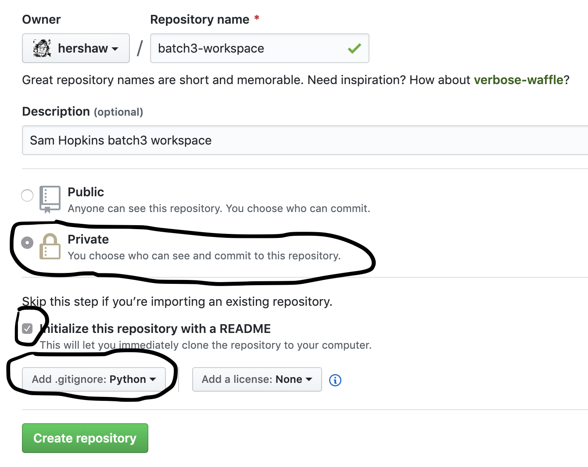
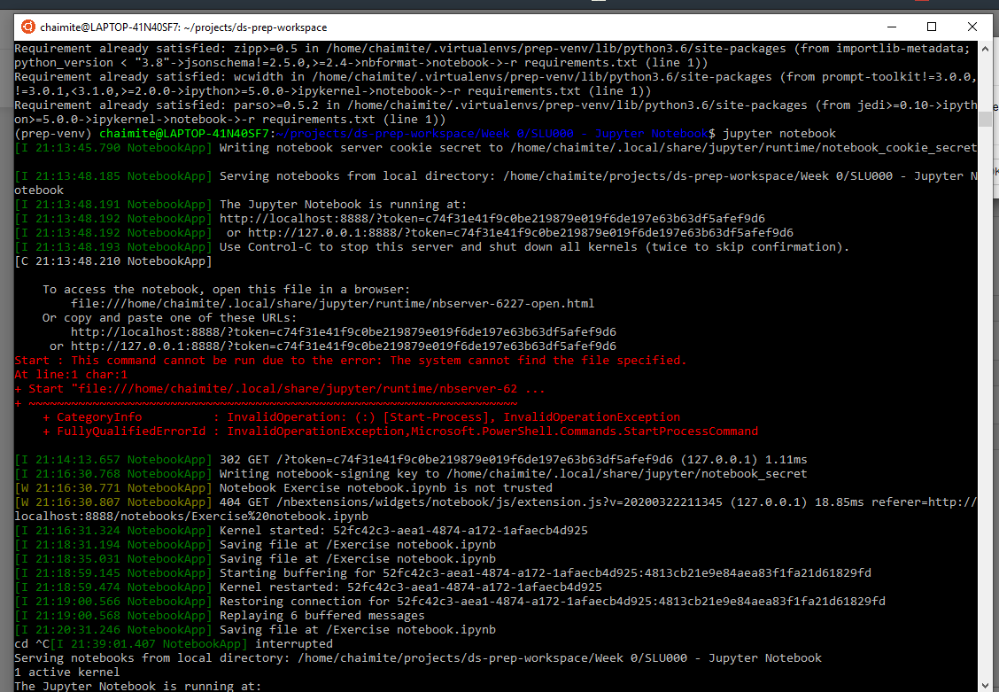

# Data Science Prep Course 2021

Welcome to the Data Science Prep Course repository! 🧑‍💻

Your first step in this journey is to **carefully read** the steps in this tutorial. You'll learn:
- How to set up your environment;
- The weekly workflow to follow during the Prep Course.

<br>


## 📌 _Check all "#TODO"s before PR._

# Prep Course Tutorial

Follow these steps to make sure your machine is ready **before** the course starts (April 5, 2021).

### **Initial Setup (do this before April 5 !!)**

1. [Initial Setup](#1-initial-setup)

    1.1 (a) [Windows Setup](#11a-Windows-Setup)
          (b) [MacOS Setup](#11b-macos-setup)

    1.2 [Setup Git and GitHub](#12-setup-git-and-github)

    1.3 [Setup your Workspace Repository](#13-setup-your-workspace-repository)

    1.4 [Clone the ds-prep-course-2021 repository](#14-clone-the-ds-prep-course-2021-repository)

    1.5 [Installing Python 3.7 and all necessary packages](#15-installing-python-37-and-all-necessary-packages)

    1.6 [Testing the workflow](#16-testing-the-workflow)


### **Weekly workflow**

2. [Learning Unit Workflow](#2-learning-unit-workflow)

3. [Working on the learning units](#2-working-on-the-learning-units)

4. [Updates to Learning Units](#4-updates-to-learning-units)

### **Help**

5. [How to ask for help](#5-how-to-ask-for-help)

6. [Troubleshooting](#6-Troubleshooting)
    
7. [Tips and Tricks](#7-Tips-and-Tricks)

8. [Tutorial videos](#8-videos)

<br>

🎁🎬 Check the [tutorial videos](#videos) if you have any doubts after following this tutorial.

<br>

---
## **1. Initial Setup**


By completing this you will setup and learn about all the tools you'll be
using during the academy. Don't worry if you can't figure out what some of the the commands you will use do. 
Anything that is important will be explained in more detail during the course.

⚠️ **Important**: You should complete this setup by April 5, as the course will begin on that day. If you are struggling to install any of the software mentioned below, tell us ASAP!

📝 Once you complete the setup mark yourself as completed (Yes) on #TODO [this spreadsheet](???).

<br>

### **1.1(a) Windows Setup**

This section deals with setting up Windows Subsystem for Linux (WSL) on Windows 10.
If you are using MacOS or Linux, skip this section ([go to MacOS Setup](#11b-macos-setup)).

<br>

>**Why do I need to install WSL?**
>
> Windows Subsystem for Linux (WSL) enables you to run Linux command lines inside Windows. All of our setup instructions and learning materials are created for Mac OS/Linux, so we will not be able to provide support on how to do it on Windows.  
 

If you have some doubts/worries, feel free to reach out to us.

<br>

**Windows 10 Setup**

Follow **[this guide](guides/Windows_Subsystem_for_Linux_Installation_Guide_for_Windows_10.md)** if you are running Windows 10.

<br>

### **1.1(b) MacOS Setup**

Some of the steps in the following sections will require _Homebrew_ for MacOS.
_Homebrew_ will make it easier to install software that we'll use later on.  

**Step 1:** To open the terminal, choose one:
* In Finder , open the /Applications/Utilities folder, then double-click Terminal.
* By pressing <kbd>cmd</kbd> + <kbd>space</kbd> then type `terminal` and press <kbd>enter</kbd>.

    The terminal should now be open:

    

<br>

**Step 2:** Copy and paste the following line in the terminal:
    ```bash
    /bin/bash -c "$(curl -fsSL https://raw.githubusercontent.com/Homebrew/install/master/install.sh)"
    ```
    You may be prompted to install the _Command Line Developers Tools_. Confirm and, once it finishes, continue installing _Homebrew_ by pressing <kbd>enter</kbd> again.

<br>

### **1.2 Setup _Git_ and _GitHub_**

**Git** is a distributed version-control system for tracking changes in source  code. A **repository** is where code lives, and the code from the prep course will live at [`ds-prep-course-2021`](https://github.com/LDSSA/ds-prep-course-2021) repository. This is where the learning materials and exercises will be released (made available).

**Step 1:** Install Git

(a) Under **Ubuntu**, open an Ubuntu terminal and run the following command:
```bash
sudo apt update && sudo apt upgrade && sudo apt install git
```

(b) Under **MacOS**, open a terminal and run the following command:
```bash
brew install git
```
<br>

**Step 2:** Create a _GitHub_ account

[Sign up](https://github.com/join) for a _GitHub_ account and follow the instructions.

<br>

### **1.3 Setup your Workspace Repository**

The workspace directory/repository is where you will place everything you
are working on, where you will make changes to files, write code, etc.

<br>

#### **1.3.1 Creating the Workspace**

<br>

**Step 1:** Log into _GitHub_

**Step 2:** In the upper-right corner of the page, click the "+" button and select `New repository`:


**Step 3:** Create a new **private** repository called *ds-prep-workspace*. 

1. You need to explicitly select Private - This is your private work environment. 

1. Initialize with a README. 

1. Add a Python `.gitignore`.



You can also check
[Creating a new repository](https://help.github.com/en/articles/creating-a-new-repository) on GitHub for help.

<br>

#### **1.3.2 Cloning the Workspace**

<br>

**Step 1:** Open a terminal (or use one you've already opened)

**Step 2:** Create a folder named `projects` by using the `mkdir` command:
```bash
mkdir ~/projects
```

**Step 3:** Enter the folder by using the `cd` command:

```bash
cd ~/projects
```

**Step 3:** You can now **clone** the `ds-prep-workspace` repository you created on GitHub by using the `git clone` command:

 _**Note:** Replace `<username>` below with your github username._

```bash
git clone https://github.com/<username>/ds-prep-workspace.git
```

**Step 4:** You'll be asked for your git username. Type it and press <kbd>enter</kbd>. Then you'll be asked for your git password. Type it and press <kbd>enter</kbd>

You should now have a local copy of your `ds-prep-workspace` in your `~/projects/ds-prep-workspace` folder.

<br>

_By August 13, 2021, the username+password authentication [will no longer be supported](https://github.blog/2020-12-15-token-authentication-requirements-for-git-operations/)._

<br>

### **1.4 Clone the `ds-prep-course-2021` repository**

<br>


Let's clone the [`ds-prep-course-2021`](https://github.com/LDSSA/ds-prep-course-2021) repository, [just like we did](#132-cloning-the-workspace) for `ds-prep-workspace`. This is where all of the learning materials will be made available, as the academy progresses.

**Step 1:** Open a terminal (or use one you've already opened) and enter the `projects` folder:
```bash
cd ~/projects
```

**Step 2:** Clone the Prep Course repository (it's the same that contains the README you're reading right now!):
```bash
git clone https://github.com/LDSSA/ds-prep-course-2021.git
```

⚠️ You only need to clone a repository **once**, so you won't need to repeat these steps during the course!

<br>

### **1.5 Installing Python 3.7 and all necessary packages**

<br>

#### **1.5.1(a) Set up Python 3.7 in Ubuntu**

<br>

**Step 1:** Open an Ubuntu terminal and check what version of Python you have:

```bash
python3 --version
```

**Step 2:** If your version is not `Python 3.7.x` (`x` = any number), run the following to install **Python 3.7**:

```bash
#TODO - install steps Python 3.7
```

**Step 3** Run the following command to get `pip` and `venv`:
```bash
sudo apt update && sudo apt upgrade && sudo apt install python3-pip python3-venv
```
**Why do we install these?**
- we'll be using `pip` which is the reference Python package manager;
- you should always use a virtual environment to install python packages. We'll use `venv` to set them up.

<br>

#### **1.5.1(b) Set up Python 3.7 in Mac OS**

<br>

If you are using **Mac OS** you will need to install python, this can be done in a terminal by running:
```bash
brew install python
#TODO - Install Python 3.7 and setup packages in Mac OS
```

### **1.6 Creating a virtual environment**

Before you work on a learning unit, you'll need to activate a [**virtual environment**](https://realpython.com/python-virtual-environments-a-primer/#what-is-a-virtual-environment). By using a virtual environment, you ensure that you have a stable and compatible set of Python packages. Don't work outside a virtual environment. Don't say we didn't warn you.

For this Prep Course we will use the same environment throughout, since we won't need too many packages. In the LDSSA though, you'll be creating new environments as each learning unit is released.

**Step 1:** Start by ensuring `pip`, `setuptools`, and `wheel` are up to date:

```bash
python3.7 -m pip install --user --upgrade pip setuptools wheel
```

**Step 2:** Create a virtual environment with the name `prep-venv`:
```bash
python3.7 -m venv ~/.virtualenvs/prep-venv
```
**Step 3:** Activate the environment

```bash
source ~/.virtualenvs/prep-venv/bin/activate
```

After you activate your virtual environment you should see at the leftmost of your command line the name of your virtual environment surrounded by parenthesis, like this:

```bash
(prep-venv) mig@macbook-pro %
```

**Step 4:** Finally, don't forget to update `pip`.
```bash
pip install -U pip
```

You can also follow [this guide](guides/How_to_set_up_python_virtual_environments.md) for a more in depth set of instructions that accomplish exactly the same thing.

<br>

### **1.7 Testing the workflow**
Finally, test the workflow ([next section](#2-learning-unit-workflow)) on `"Week 0"`. After that you'll be officially ready to start the course! This folder is used to give instructors guidelines to produce the learning units. We are also using it to ensure that you are able to run and submit a learning unit.


<br>

---

## **2. Learning Unit Workflow**

**Each week** a new folder is released on [`ds-prep-course-2021`](https://github.com/LDSSA/ds-prep-course-2021) repository. On week 1 (April 5 - April 11), the folder released will be called `"Week 1"`. On week 2, it will be called `"Week 2"`, and so on. These folders contain the learning units you'll be working on. The releases will be announced on Slack, on the ___#announcements___ channel.

⚠️ **Important:** You will need to follow the steps described in this section **every** week, after each release.

<br>

### **Step 1: Pull the learning materials**
Pull the changes from the 
[ds-prep-course-2021](https://github.com/LDSSA/ds-prep-course-2021) repo by running the following commands on your Ubuntu terminal:
    
```bash
cd ~/projects/ds-prep-course-2021/
```
```bash
git pull
```

* **Note:** the `git pull` command pulls all new changes from the remote repository to your local copy (`~/projects/ds-prep-course-2021`).

<br>

### **Step 2: Copy to your workspace**
Copy the weekly folder to your local `ds-prep-workspace`:

```bash
cp -r ~/projects/ds-prep-course-2021/"Week <week number>" ~/projects/ds-prep-workspace/
``` 
* **Note:** Replace `"Week <week number>"` by the appropriate folder name on the command above. Example: for Week 0 you should write `"Week 0"`
* If you're curious about how you could this using your OS GUI [check this guide](guides/using_os_gui_to_manage_directories.md)

<br>

### **Step 3: Activate the virtual environment**
Activate the `prep-venv` environment you created on the Initial Setup:
```bash
source ~/.virtualenvs/prep-venv/bin/activate
```
<br>

### **Step 4: Install the `requirements`**
Install the python packages from `requirements.txt` for each learning unit (there are multiple learning units (SLU's) in a Week!)

```bash
pip install -r ~/projects/ds-prep-workspace/"Week <week number>"/"<SLU name>"/requirements.txt
```

**Example:** For Week 0 you'd do:
```bash
pip install -r ~/projects/ds-prep-workspace/"Week 0"/"SLU00 - Jupyter Notebook"/requirements.txt
```

<br>

### **Step 5 - Go to `ds-prep-workspace`**
Enter the `ds-prep-workspace` directory:

```bash
cd ~/projects/ds-prep-workspace
```

<br>

### **Step 6 - Open Jupyter Notebook**

Open the Jupyter Notebook application by running:
```bash
jupyter notebook
```
If you are running **Windows 10**, run the following **instead**:
```bash
jupyter notebook --NotebookApp.use_redirect_file=False
```

**What should happen now?**

- When you run the `jupyter notebook` command, you should see something similar to this in your terminal:


- and your browser should pop up with Jupyter open, however, if this does not happen, you can simply copy the link you see on your terminal (the one that contains `localhost`) and past it in your browser's address bar:  

> **Note:** If you see some  scary looking messages, don't worry, you can just ignore them.

<br>

### **Step 7**
The previous command should open a localhost page on your browser. 

Now follow the steps on [Working](#3-working-on-the-learning-units) on how to work on the notebooks and come back to **Step 8** when you're done.

<br>

### **Step 8**

Since all tests pass or once you're happy, save your work, close the browser tab with the Jupyter Notebook, close the terminal.

<br>

### **Step 9:**
Open a new terminal and run the following 4 commands sequentiallty:

* Go to your workspace folder:
```bash
cd ~/projects/ds-prep-workspace
```

* Stage your changes:
```bash
git add .
```

* Commit your changes with an informative message:
```bash
git commit -m "Work on week <week number> exercises"
```

* Push to your remote repository:
```bash
git push
```

<br>

## **3. Working on the Learning Units**

All learning units come as a set of **Jupyter Notebooks** (and some links to presentations). Jupyter Notebooks are documents that can contain text, images and live code that you can run interactively.

Once you have activated your environment and opened the Jupyter Notebook application (steps 1-6 of the [workflow](#2-learning-unit-workflow)) feel free to explore the sample learning unit structure. It will give you a handle on what to expect and what rules the instructors
follow (and the effort they put) when creating a learning unit.

> **Note:** It is **VERY IMPORTANT** that you **ALWAYS** work on the files on your `ds-prep-workspace` repository, and **NEVER** work on files that are in your `ds-prep-course-2021` repository!


1. Activate the environment and run jupyter notebook




##### The Exercise Notebook

Make sure you open and go through the Learning Notebook first.

Every learning unit contains an exercise notebook with exercises you will
work on.
So let's have a look at the sample Learning Unit. 
1. On the Jupyter Notebook UI in the browser open the exercise notebook

1. Follow the instructions provided in the notebook

You'll see cells with the exercises and cells for you to write solutions.

Once you've solved all of the notebook we recommend following this simple 
checklist to avoid unexpected surprises.
1. Save the notebook (again)
1. Run "Restart & Run All"

1. At this point the notebook should have run without any error messages
showing up.
1. When you're done (after saving your work) you can go to the terminal and close it:


#### Commit and Push

>Note: It is **VERY IMPORTANT** that you **ALWAYS** work on the files in your `ds-prep-workspace` repository, and **NEVER** work on files that are in your `ds-prep-course-2021` repository! So before you do this step, make sure that the files you made changes to are the ones in your `ds-prep-workspace` folder.

Now you have worked on the sample learning unit and you have some uncommitted 
changes.
It's time to commit the changes, which just means adding them to your 
`ds-prep-workspace` repository history, and pushing this history to your 
remote on _GitHub_.

* First you need to configure your email and username (replace "mig.dias.1212@gmail.com" with your email, and "buedaswag" with your username):
```bash
git config --global user.email "mig.dias.1212@gmail.com"
git config --global user.username "buedaswag"
git config --global user.name "Bueda Swag"
```

* Using the terminal first make sure you're in the right directory (using the `cd` command), then commit and push the changes
```bash
cd ~/projects/ds-prep-workspace
git add .
git commit -m 'Testing the sample notebook'
git push
```

* Now type your git username, then press <kbd>enter</kbd>
* Then type your git password , then press <kbd>enter</kbd>
* You're all set!

<br>

## **3. Updates to Learning Units**

As much as we try and have processes in place to prevent errors and bugs in the learning units some make it through to you.

If the problem is not in the exercise notebook you can just pull the new version from the `ds-prep-course-2021` repo and replace the file on your `ds-prep-workspace` (steps 1 and 2 from last section).

If the correction is in the exercise notebook, however, you can't just replace the file because your work is there and you'll lose it!

When a new version of the exercise notebook is released (and announced) you will have to merge the work you've already did into the new version of the notebook.

At the moment our suggestion to merge the changes is: 
1. Rename the old version;
1. Copy the new exercise notebook over;
1. Open both and copy paste your solutions to the new notebook.

We understand it's not ideal and are working on improving this workflow.

<br>

## **4. Help**

### 4.1 How to ask for help

During the Prep Course you will surely run into problems and have questions about the materials.
Please refer to [this wiki page](https://github.com/LDSSA/wiki/wiki/Data-Science-Prep-Course#how-to-ask-for-help) on how to ask for help!

### 4.2 Troubleshooting

1. [When I open Windows Explorer through Ubuntu, it goes to a different folder than in the guide](#When-I-open-Windows-Explorer-through-Ubuntu,-it-goes-to-a-different-folder-than-in-the-guide)
1. [Tips and Tricks](#Tips-and-Tricks)
1. [When I pull from the `ds prep course` repository, I get an error](#When-I-pull-from-the-ds-prep-course-2021-repository,-I-get-the-error)
1. [When I try to open `jupyter notebook`, I get an error](#When-I-try-to-open-jupyter-notebook,-I-get-the-error)
1. [When I use the `cp` command the `>` sign appears and the command does not execute](#When-I-use-the-`cp`-command-the->-sign-appears-and-the-command-does-not-execute)

#### When I open Windows Explorer through Ubuntu, it goes to a different folder than in the guide

* Please make sure:
    * you are running the command `explorer.exe .` including the dot at the end.
    * you are running Windows 10 version `1909` or newer.

#### Ubuntu on Windows 10 high CPU usage, crashes

* First please make sure you are running Windows 10 version `1909` or newer.
* Then, try following [these steps](https://teckangaroo.com/enable-windows-10-virtual-machine-platform/)

#### When I pull from the `ds-prep-course-2021` repository, I get the error:

```
error: Your local changes to the following files would be overwritten by merge:  
<some files>
Please commit your changes or stash them before you merge.
Aborting
```

_git_ is telling us that changes were made by you to the files on the `~/projects/ds-prep-course-2021` folder, and is not pulling the changes made by the instructors because they would override the changes that you made there. To fix this do the following:
1. make sure that any change you made to the files on `~/projects/ds-prep-course-2021`  (that you want to not lose) is saved in your `~/projects/ds-prep-workspace` repository (see https://github.com/LDSSA/ds-prep-course-2021#updates-to-learning-units for how to do this), and if you don't want to keep the changes you made to these files, just continue on to the next step
2. go to the `~/projects/ds-prep-course-2021` folder and run: 

    ```
    cd ~/projects/ds-prep-course-2021
    git stash
    ```

3. now you can pull from the `ds-prep-course-2021` repository:

    ```
    git pull
    ```

#### When I try to open `jupyter notebook`, I get the error:

```
migs-MBP% jupyter notebook
zsh: command not found: jupyter
```

Before opening `jupyter notebook` activate your virtual environment:

```
source ~/.virtualenvs/prep-venv/bin/activate
```

#### When I use the `cp` command the `>` sign appears and the command does not execute

```
cp -r ~/projects/ds-prep-course-2021/“Week 0" ds-prep-workspace
>
```

Make sure to use this type of quotes `"` and not these ones `“`.

#### My problem is not listed here, what should I do?

If the above steps didn't solve the problem for you, please contact us on Slack or if you are not on slack, [open an issue](https://guides.github.com/features/issues/)

### 4.3 Tips and Tricks

Coming soon.


## 5. Videos

You can find here some video guides that follow this setup:

* [Setup guide for Windows - Part 1](https://www.youtube.com/watch?v=fWi3bYoHW18)
* [Setup guide for Windows - Part 2](https://www.youtube.com/watch?v=bnJOQHh9pJ4)
* [Setup guide for Mac](https://www.youtube.com/watch?v=qs0z4ibMFdU)
* [Updates to Learning Units guide for Windows 10](https://www.youtube.com/watch?v=Q2Cezm6ufrE)
* [Updates to Learning Units guide for Mac](https://www.youtube.com/watch?v=-fzIDfNBZ0I)