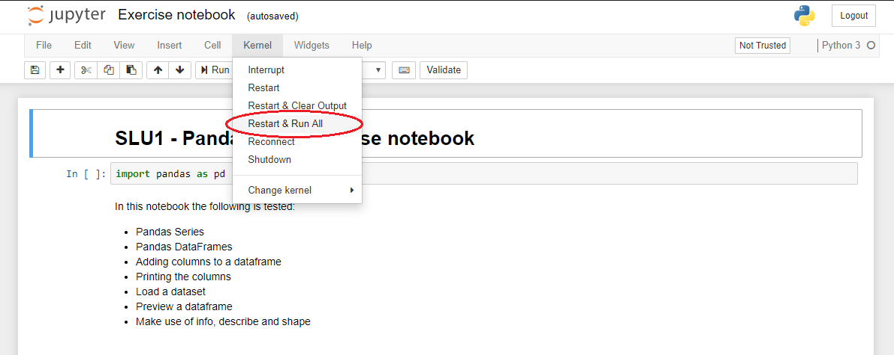

# Data Science Prep Course Repository

Welcome to Data Science Prep Course repository. Here is where you'll find all information needed to setup your environment and the
workflow you'll use during the Prep Course.

1. [Initial Setup](#initial-setup)
    1. [Videos](#videos)
    1. [Windows Setup](#Windows-Setup)
    1. [Setup Git and GitHub](#setup-git-and-github)
    1. [Setup your Workspace Repository](#setup-your-workspace-repository)
    1. [Get the Learning Material](#get-the-learning-material)
    1. [Running a Learning Unit](#Running-a-Learning-Unit)
1. [Learning Unit Workflow](#learning-unit-workflow)
1. [Updates to Learning Units](#updates-to-learning-units)
1. [Help](#help)
    1. [Troubleshooting](#Troubleshooting)
1. [Tips and Tricks](#Tips-and-Tricks)

## Initial Setup

**IMPORTANT**  
Before the prep-course you will have to complete these instructions, this is 
essential.

Once you complete the setup mark yourself as completed (Yes) on [this spreadsheet](https://docs.google.com/spreadsheets/d/1NDddtliEi8RdGmEogCz2Lz-Yyq3IM6wjYDY1IuR18GI/edit?usp=sharing).
Make sure that you complete the setup by the 30th of March, as the course will begin on that day. If you are struggling to install any of the software mentioned below, tell us ASAP! The course by itself will be very intensive, so we do not want you to waste time setting up after the 30th of March!! 

By completing this you will setup and learn about all the tools you'll be
using during the academy. We will also be able to identify any problems in time to figure out a solution.

Don't worry if you can't figure out what some of the the commands you will
use do. 
Anything that is important will be explained in more detail during the course.

### Videos

You can find here some video guides that follow this setup:

* [Setup guide for Windows - Part 1](https://www.youtube.com/watch?v=fWi3bYoHW18)
* [Setup guide for Windows - Part 2](https://www.youtube.com/watch?v=bnJOQHh9pJ4)
* [Setup guide for Mac](https://www.youtube.com/watch?v=qs0z4ibMFdU)
* [Updates to Learning Units guide for Windows 10](https://www.youtube.com/watch?v=Q2Cezm6ufrE)
* [Updates to Learning Units guide for Mac](https://www.youtube.com/watch?v=-fzIDfNBZ0I)

### Windows Setup

This section deals with setting up Windows Subsystem for Linux (WSL) on Windows 10.
If you are using MacOS or Linux you can skip this section.  

##### Why do I need to install WSL?

Because of the differences in command line syntax between Windows vs Mac OS/Linux, it would be a great challenge for us to support and provide instructions for both Operating Systems. So, we’d ask you to install Windows Subsystem for Linux, which would enable you to run Linux command lines inside Windows. Keep in mind that these are simply extensions to your Windows operating system, hence, installing this software will not do any changes to your laptop. It is also quick and easy to do so.
 
If you cannot install WSL for whatever reason, you can still join the Prep Course and follow the Learning materials. However, all of our setup instructions and learning materials are created for Mac OS/Linux, and we will not be able to provide support on how to do it on Windows.

If you have some doubts/worries, feel free to reach out to us.

#### Windows 10 Setup

Follow [this guide](guides/Windows_Subsystem_for_Linux_Installation_Guide_for_Windows_10.md) if you are running Windows 10. As mentioned in the Application phase, we won't be able to support older Windows versions.

### MacOS Setup

Some of the steps in the following sections will require _Homebrew_ for MacOS.
Homebrew will make it easier to install software that we'll use later on.  
To open the terminal, choose one:
* In Finder , open the /Applications/Utilities folder, then double-click Terminal.
* By pressing <kbd>cmd</kbd> + <kbd>space</kbd> then type `terminal` and press <kbd>enter</kbd>.

The terminal should now be open:


Copy and paste the following line in the terminal:
```bash
/bin/bash -c "$(curl -fsSL https://raw.githubusercontent.com/Homebrew/install/master/install.sh)"
```
You may be prompted to install the _Command Line Developers Tools_ confirm and
once it finishes, continue installing Homebrew by pressing <kbd>enter</kbd> again.

### Setup _Git_ and _GitHub_

Git is a distributed version-control system for tracking changes in source 
code.  
A repository is where code lives, and the code from the prep course will live in [ds-prep-course](https://github.com/LDSSA/ds-prep-course) repository, and the learning materials and exercises will be released (made available) in that repository.

#### Install Git

##### Under Ubuntu
Open a terminal (or use one you've already opened) and run:
```bash
sudo apt update && sudo apt upgrade && sudo apt install git
```

##### Under MacOS
```bash
brew install git
```

#### Create a _GitHub_ account

[Sign up](https://github.com/join) for a _GitHub_ account and follow 
instructions.

### Setup your Workspace Repository

The workspace directory/repository is where you will place everything you
are working on, where you will make changes to files, write code, etc.

#### Creating the Workspace

1. Log into _GitHub_
1. In the upper-right corner of the page, there should be a signin button, and then select `New repository`

1. Create a new **private** _GitHub_ repository called *ds-prep-workspace*, see 
[Creating a new repository](https://help.github.com/en/articles/creating-a-new-repository). 
1. You need to explicitly select Private - This is your private work environment. 
1. Initialize with a README. 
1. Add a Python `.gitignore`.


#### Cloning the Workspace

* Open a Terminal (or use one you've already opened)
* We're going to have a folder named `projects` where we will keep the repositories we'll be using.
* We're going to use the `mkdir` command to create it, and the `cd` command to enter the folder: 

```bash
mkdir ~/projects
cd ~/projects
```m

* You can now clone (retrieve from GitHub) your /ds-prep-workspace repository using the `git clone` command:
    >Note: in the link used in the command bellow, be sure to replace `<username>` with your github username. (ie: my github username is `buedaswag`, so the link would be):
`https://github.com/buedaswag/ds-prep-workspace.git`

```bash
git clone https://github.com/<username>/ds-prep-workspace.git
```

* Now type your git username, then press <kbd>enter</kbd>
* Then type your git password , then press <kbd>enter</kbd>
* You're all set!

### Get the Learning Material

You will be cloning the [ds-prep-course](https://github.com/LDSSA/ds-prep-course) 
repository.
All of the learning material you need will be made available on this repo
as the academy progresses.  

1. Open a Terminal (or use one you've already opened)
1. Make sure you're in the right directory (use the `cd` command to enter the `~/projects`)
1. Clone the students repository 
[ds-prep-course](https://github.com/LDSSA/ds-prep-course)
```bash
cd ~/projects
git clone https://github.com/LDSSA/ds-prep-course.git
```

#### Get the Week 0 Learning Unit

In the `ds-prep-course` repository that you just cloned there is a Week 0
learning unit.
It's used to give instructors guidelines to produce the learning units.
We are also using it to ensure that you are able to run and submit a learning 
unit.

So go ahead and copy the `Week 0` directory that contains the `SLU000 - Jupyter Notebook` from the `
ds-prep-course` repository to your repository (named `ds-prep-workspace`).  

You can do that either using the command line, or the Operating System's Graphical User Interface.

##### Using the command line

If you have both the `ds-prep-course` and `ds-prep-workspace` in a
_projects_ directory you could do it using the command line like this:
```bash
cp -r ~/projects/ds-prep-course/"Week 0" ds-prep-workspace
```

##### Using the Operating System's Graphical User Interface

* On WSL with Ubuntu:
    * first enter the `~/projects/ds-prep-course` directory using the `cd` command, then run `explorer.exe .` **(don't forget to include the dot! the dot means "current directory")** to open Windows explorer in the current directory:

```bash
cd ~/projects/ds-prep-course
explorer.exe .
```

Windows Explorer should pop up now:


* On Mac:
    * In Finder , open the "Go" menu, choose the option "Go to folder..."


then paste the path to the `ds-prep-course` repository: `~/projects/ds-prep-course`, then click "Go".


### Running a Learning Unit

#### Creating Python Virtual Environment and installing the necessary packages

Bellow are the instructions that are enough to get the setup done and get you up and running :)  
You can also follow [this guide](guides/How_to_set_up_python_virtual_environments.md) for a more in depth set of instructions that accomplish exactly the same thing.

You should always be using a virtual environment to install python packages. We'll use _venv_ to set them up.  

To install and update packages, we'll be using _pip_ which is the reference Python package manager.   

If you are using **Ubuntu** you will need to install a couple of packages first,
this can be done in a terminal by running:
```bash
sudo apt update && sudo apt upgrade && sudo apt install python3-pip python3-venv
```

If you are using **Mac OS** you will need to install python, this can be done in a terminal by running:
```bash
brew install python
```

##### Start by installing ensuring pip, setuptools, and wheel are up to date:

```bash
python3 -m pip install --user --upgrade pip setuptools wheel
```

* Create a virtual environment with the name `prep-venv`
```bash
python3 -m venv ~/.virtualenvs/prep-venv
```
* Activate the environment

```bash
source ~/.virtualenvs/prep-venv/bin/activate
```

>Note: after you activate your virtual environment you should see at the leftmost of your command line the name of your virtual environment surrounded by parenthesis, like this:

```bash
mig@macbook-pro % source ~/.virtualenvs/prep-venv/bin/activate
(prep-venv) mig@macbook-pro %
```
And you're able to make sure your virtual environment is active using the `which` command:

```bash
(prep-venv) mig@macbook-pro % which python
/Users/mig/.virtualenvs/prep-venv/bin/python
```

Please don't forget to update pip.
```bash
pip install -U pip
```

This means that our virtual environment is active.

*IMPORTANT!!!* make sure that your virtual environment is active before you proceed

* Now you're ready to install packages! Just enter the directory of the `SLU000 - Jupyter Notebook` using the `cd` command, and install the required packages that are enumerated in the `requirements.txt` file

```bash
cd ~/projects/ds-prep-workspace/"Week 0"/"SLU000 - Jupyter Notebook"
pip install -r requirements.txt
```

#### Working on the Learning Unit

All learning units come as a set of Jupyter Notebooks (and some links to
presentations).
Notebooks are documents that can contain text, images and live code that you
can run interactively.

In this section we will launch the Jupyter Notebook application.
The application is accessed through the web browser.

Once you have the application open feel free to explore the sample learning
unit structure.
It will give you a handle on what to expect and what rules the instructors
follow (and the effort they put) when creating a learning unit.

So let's start the Jupyter Notebook app:
* Activate your virtual environment
* Enter the Learning unit directory in your workspace directory (`ds-prep-workspace`). 
    >Note: It is **VERY IMPORTANT** that you **ALWAYS** work on the files on your `ds-prep-workspace` repository, and **NEVER** work on files that are in your `ds-prep-course` repository!
* Run the jupyter notebook
    >**Windows 10 note:** if you are running **Windows 10**, the command to run the jupyter notebook is: `jupyter notebook --NotebookApp.use_redirect_file=False`


```bash
source ~/.virtualenvs/prep-venv/bin/activate
cd ~/projects/ds-prep-workspace/"Week 0"/"SLU000 - Jupyter Notebook"
jupyter notebook
```

1. Activate the environment and run jupyter notebook
1. When you run the `jupyter notebook` command, you should see something similar to this in your terminal:

1. and your browser should pop up with Jupyter open, however, if this does not happen, you can simply copy the link you see on your terminal (the one that contains `localhost`) and past it in your browser's address bar: 


>Note: If you see these scarry looking error messages, don't worry, you can just ignore them.


##### The Exercise Notebook

Make sure you open and go through the Learning Notebook first.

Every learning unit contains an exercise notebook with exercises you will
work on.
So let's have a look at the sample Learning Unit. 
1. On the Jupyter Notebook UI in the browser open the exercise notebook

1. Follow the instructions provided in the notebook

You'll see cells with the exercises and cells for you to write solutions.

Once you've solved all of the notebook we recommend following this simple 
checklist to avoid unexpected surprises.
1. Save the notebook (again)
1. Run "Restart & Run All"

1. At this point the notebook should have run without any error messages
showing up.
1. When you're done (after saving your work) you can go to the terminal and close it:


#### Commit and Push

>Note: It is **VERY IMPORTANT** that you **ALWAYS** work on the files in your `ds-prep-workspace` repository, and **NEVER** work on files that are in your `ds-prep-course` repository! So before you do this step, make sure that the files you made changes to are the ones in your `ds-prep-workspace` folder.

Now you have worked on the sample learning unit and you have some uncommitted 
changes.
It's time to commit the changes, which just means adding them to your 
`ds-prep-workspace` repository history, and pushing this history to your 
remote on _GitHub_.

* First you need to configure your email and username (replace "mig.dias.1212@gmail.com" with your email, and "buedaswag" with your username):
```bash
git config --global user.email "mig.dias.1212@gmail.com"
git config --global user.username "buedaswag"
git config --global user.name "Bueda Swag"
```

* Using the terminal first make sure you're in the right directory (using the `cd` command), then commit and push the changes
```bash
cd ~/projects/ds-prep-workspace
git add .
git commit -m 'Testing the sample notebook'
git push
```

* Now type your git username, then press <kbd>enter</kbd>
* Then type your git password , then press <kbd>enter</kbd>
* You're all set!

## Learning Unit Workflow

You will need to follow this workflow every week starting from week 1.  

Learning units will be announced in the academy's _#announcements_ channel.
At this point they are available in the 
[ds-prep-course](https://github.com/LDSSA/ds-prep-course) 
repository.  
A new Learning Unit is released every Monday, and its 
solutions are then released the next Monday.  

The steps you followed during the initial setup are exactly what you are going
to be doing for each new Learning Unit.
Here's a quick recap:
1. Once a new Learning Unit is available at the beginning of each week, pull the changes from the 
[ds-prep-course](https://github.com/LDSSA/ds-prep-course) repo:
    * enter the `~/projects/ds-prep-course/` using the `cd` command, then use the `git pull` command:
    ```bash
    cd ~/projects/ds-prep-course/
    git pull
    ``` 
    >note that this will also pull the solutions for the Learning Unit of the previous week
1. Copy the Learning Unit to your `ds-prep-workspace` repo
    * To do that you can use the `cp` command:
    ```bash
    cp -r ~/projects/ds-prep-course/"Week <week number>" ~/projects/ds-prep-workspace
    ``` 
    and you would replace the `<week number>` with the week number, such that in week 0, for example, the command would be:
    ```bash
    cp -r ~/projects/ds-prep-course/"Week 0" ~/projects/ds-prep-workspace
    ``` 
1. Activate your virtual environment
    ```bash
    source ~/.virtualenvs/prep-venv/bin/activate
    ```
1. Install the python packages from requirements.txt for the specific SLU (you must do this for each SLU, and there are multiple SLU's in a Week)
    ```bash
    pip install -r ~/projects/ds-prep-workspace/"Week <week number>"/"<SLU name>"/requirements.txt
    ```
    and you would replace `<week number>` and `<SLU name>`, such that in Week 0 and SLU000 - Jupyter Notebook, for example, the command would be:
    ```bash
    pip install -r ~/projects/ds-prep-workspace/"Week 0"/"SLU000 - Jupyter Notebook"/requirements.txt
    ```
1. Change to the `ds-prep-workspace` dir
    ```bash
    cd ~/projects/ds-prep-workspace
    ```
1. Open Jupyter Notebook
    ```bash
    jupyter notebook
    ```
1. Work
1. Once all tests pass or once you're happy, save your work, close the browser tab with the Jupyter Notebook, close the terminal and open a new terminal
1. Then commit the changes and push
    ```bash
    cd ~/projects/ds-prep-workspace
    git add .
    git commit -m "Work on week <week number> exercises"
    git push
    ```
1. Profit

## Updates to Learning Units

As much as we try and have processes in place to prevent errors and bugs in 
the learning units some make it through to you.
If the problem is not in the exercise notebook you can just pull the new 
version from the ds-prep-course repo and replace the file on your ds-prep-workspace.
The problem is if the correction is in the exercise notebook, you can't just
replace the file because your work is there and you'll lose it!

When a new version of the exercise notebook is released (and announced) you will have to merge the work you've already done into the new version of the
notebook.

At the moment our suggestion to merge the changes is: 
1. Rename the old version
1. Copy the new exercise notebook over
1. Open both and copy paste your solutions to the new notebook

We understand it's not ideal and are working on improving this workflow.

## Help

During the prep-course you will surely run into problems and have doubts about the
material.
Please refer to [this wiki page](https://github.com/LDSSA/wiki/wiki/Data-Science-Prep-Course#how-to-ask-for-help) on how to ask for help!

### Troubleshooting

1. [When I open Windows Explorer through Ubuntu, it goes to a different folder than in the guide](#When-I-open-Windows-Explorer-through-Ubuntu,-it-goes-to-a-different-folder-than-in-the-guide)
1. [Tips and Tricks](#Tips-and-Tricks)
1. [When I pull from the `ds prep course` repository, I get an error](#When-I-pull-from-the-ds-prep-course-repository,-I-get-the-error)
1. [When I try to open `jupyter notebook`, I get an error](#When-I-try-to-open-jupyter-notebook,-I-get-the-error)
1. [When I use the `cp` command the `>` sign appears and the command does not execute](#When-I-use-the-`cp`-command-the->-sign-appears-and-the-command-does-not-execute)

#### When I open Windows Explorer through Ubuntu, it goes to a different folder than in the guide

* Please make sure:
    * you are running the command `explorer.exe .` including the dot at the end.
    * you are running Windows 10 version `1909` or newer.

#### Ubuntu on Windows 10 high CPU usage, crashes

* First please make sure you are running Windows 10 version `1909` or newer.
* Then, try following [these steps](https://teckangaroo.com/enable-windows-10-virtual-machine-platform/)

#### When I pull from the `ds-prep-course` repository, I get the error:

```
error: Your local changes to the following files would be overwritten by merge:  
<some files>
Please commit your changes or stash them before you merge.
Aborting
```

_git_ is telling us that changes were made by you to the files on the `~/projects/ds-prep-course` folder, and is not pulling the changes made by the instructors because they would override the changes that you made there. To fix this do the following:
1. make sure that any change you made to the files on `~/projects/ds-prep-course`  (that you want to not lose) is saved in your `~/projects/ds-prep-workspace` repository (see https://github.com/LDSSA/ds-prep-course#updates-to-learning-units for how to do this), and if you don't want to keep the changes you made to these files, just continue on to the next step
2. go to the `~/projects/ds-prep-course` folder and run: 

    ```
    cd ~/projects/ds-prep-course 
    git stash
    ```

3. now you can pull from the `ds-prep-course` repository:

    ```
    git pull
    ```

#### When I try to open `jupyter notebook`, I get the error:

```
migs-MBP% jupyter notebook
zsh: command not found: jupyter
```

Before opening `jupyter notebook` activate your virtual environment:

```
source ~/.virtualenvs/prep-venv/bin/activate
```

#### When I use the `cp` command the `>` sign appears and the command does not execute

```
cp -r ~/projects/ds-prep-course/“Week 0" ds-prep-workspace
>
```

Make sure to use this type of quotes `"` and not these ones `“`.

#### My problem is not listed here, what should I do?

If the above steps didn't solve the problem for you, please contact us on Slack or if you are not on slack, [open an issue](https://guides.github.com/features/issues/)

## Tips and Tricks

Coming soon.
