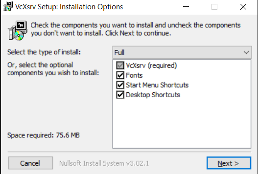
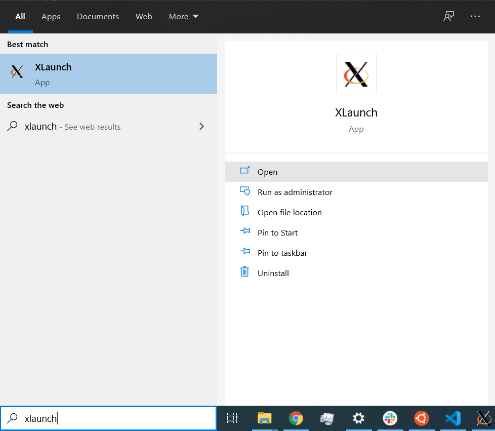
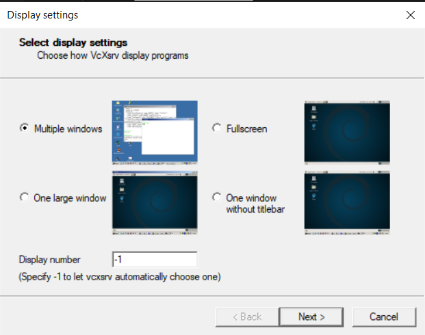

# SLU 16 - Final Project - Snake


- Principles to write good code
- Testing
- Understand and extend code written by others


## Running pygame on WSL

If you are using WSL you will need to do the steps described here.

### Download VcXsrv

1. [Click here to download VcXsrv](https://sourceforge.net/projects/vcxsrv/files/latest/download)
    the download should start.

### Run VcXsrv
1. Open the file you just downloaded
2. Proceed with the installation (you can just accept and leave everything on defaults).

    

3. Once the instalation is finished, type `xlaunch` on your Windows search bar, then open it

    

4. Then just keep clicking `Next` and leaving everything with the default values.

    

5. After that's finished, go to your `~/ds-prep-course-instructors-2021/Week 09/SUL16 - Final Project` folder and instead of typing `python main.py` to run your game, type the following:

```bash
export DISPLAY=localhost:0.0 && python main.py
```

