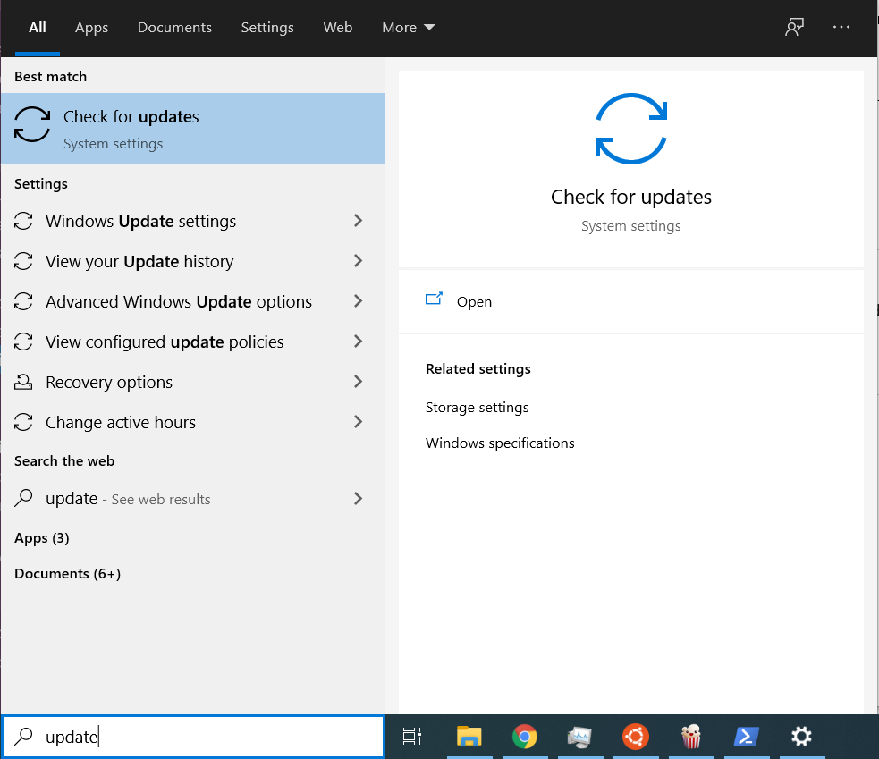
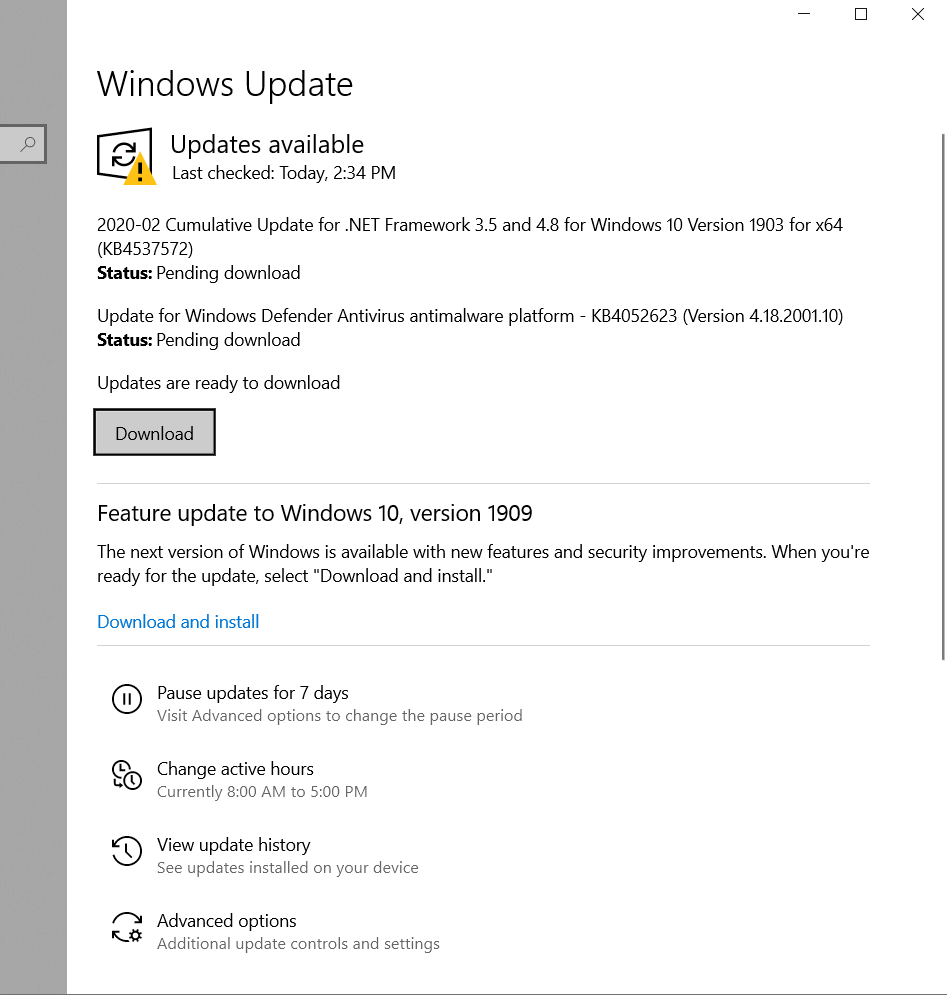
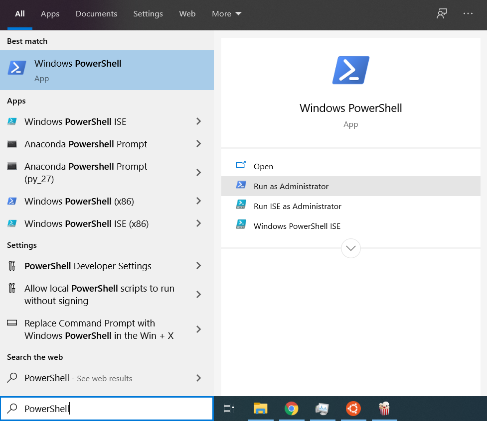
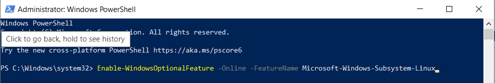
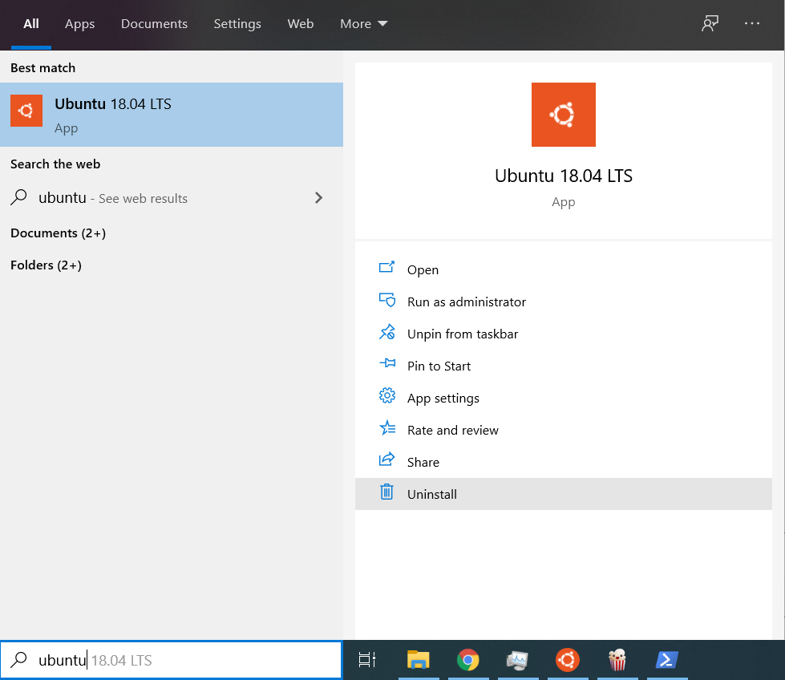
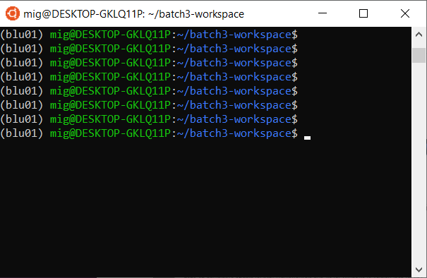
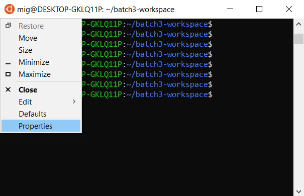
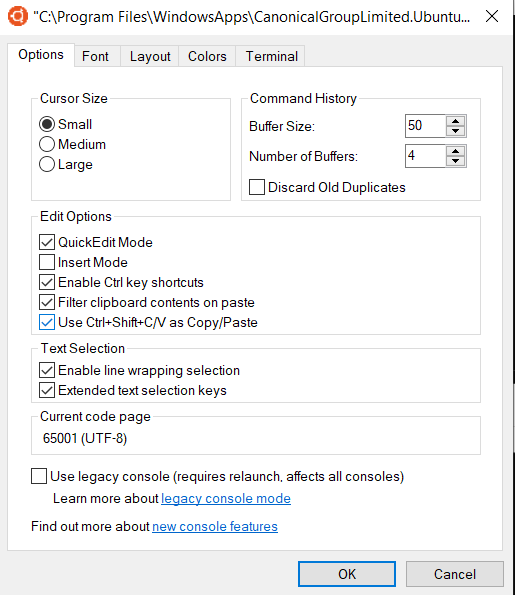
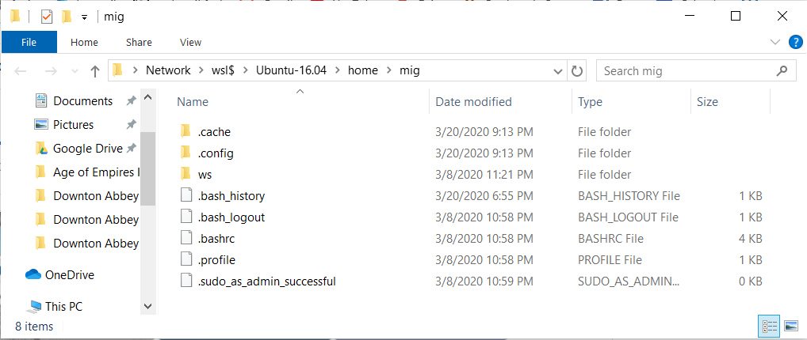

# Windows Subsystem for Linux Installation Guide for Windows 10

## Make sure that Windows is up to date

1. Type "update" in your Windows search bar 


then click "Check for Updates"



then download and install any updates that appear on the Windows Update menu (shown bellow)



After you're done installing those updates, please [check which version of Windows 10 you are running](https://support.microsoft.com/en-us/help/13443/windows-which-version-am-i-running), and if your version number is smaller that `1909`, then please keep coming back to Windows Update and installing updates untill you have at least version `1909`. Then you may proceed with the guide.

## Install the Windows Subsystem for Linux

Before installing any Linux distros for WSL, you must ensure that the "Windows Subsystem for Linux" optional feature is enabled:

1. Open PowerShell as Administrator by typing "PowerShell" in your Windows search bar 


and then clicking "Run as Administrator"



2. Then paste the following command on PowerShell 

```powershell
Enable-WindowsOptionalFeature -Online -FeatureName Microsoft-Windows-Subsystem-Linux
```



and run it by pressing <kbd>enter</kbd>:
    

3. Restart your computer if asked to.

## Install your Linux Distribution of Choice

1. Open the this link to the [Microsoft Store](https://www.microsoft.com/store/apps/9N9TNGVNDL3Q) and select "Get" to install Ubuntu.


## Launch a distro
To complete the initialization of your newly installed distro, launch a new instance. You can do this by typing "ubuntu" in your Windows search bar 




The first time a newly installed distro runs, a Console window will open, and you'll be asked to wait for a minute or two for the installation to complete.

> During this final stage of installation, the distro's files are de-compressed and stored on your PC, ready for use. This may take around a minute or more depending on the performance of your PC's storage devices. This initial installation phase is only required when a distro is clean-installed - all future launches should take less than a second.

## Setting up a new Linux user account

Once installation is complete, you will be prompted to create a new user account (and its password). 


This user account is for the normal non-admin user that you'll be logged-in as by default when launching a distro.

> You can choose any username and password you wish - they have no bearing on your Windows username. 

When you open a new distro instance, you won't be prompted for your password, but **if you elevate a process using `sudo`, you will need to enter your password**, so make sure you choose a password you can easily remember!

## Opening the WSL terminal

After that, whenever you want to use WSL, just type "ubuntu" in your Windows search bar 


Open it:


Then a terminal window will open that allows you to interact with Ubuntu.



## Enable copy and paste keyboard shortcuts

In the upper left corner of the WSL terminal, click the orange circle


then click "Properties"



Then under the "Options" tab, in the Edit Options section, make sure that "Use Ctrl+Shift+C/V as Copy/Paste" in enabled, then click "OK"



## Update & upgrade your distro's packages

Most distros ship with an empty/minimal package catalog. We strongly recommend regularly updating your package catalog, and upgrading your installed packages using your distro's preferred package manager. On Debian/Ubuntu, you use apt:

```bash
sudo apt update && sudo apt upgrade
```

> Windows does not automatically update or upgrade your Linux distro(s): This is a task that the Linux users prefer to control themselves.

## How to open Windows File Explorer to manipulate files inside WSL

If you’d like to use Windows File Explorer to manipulate the files in WSL, just type this in the WSL terminal **(don't forget to include the dot! the dot means "current directory")**:

```console
mig@DESKTOP-GKLQ11P:~$ explorer.exe .
```
The Windows Explorer should pop up:



Keep in mind that you should manipulate files and create directories inside your `Ubuntu-18.04/home/<your name>` folder.

## You're all set!  